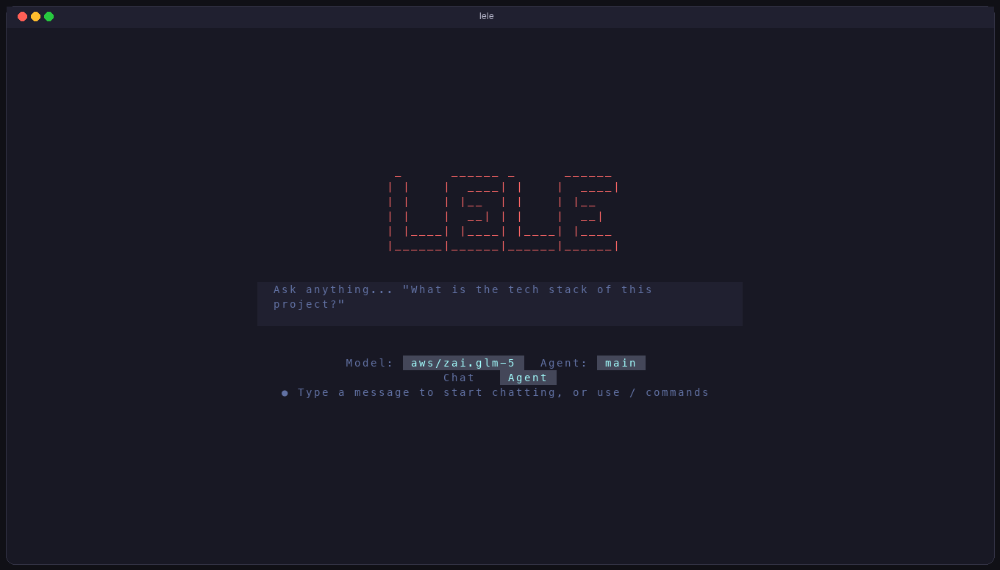
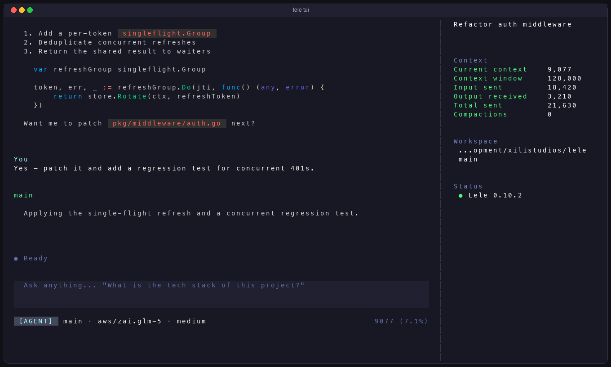
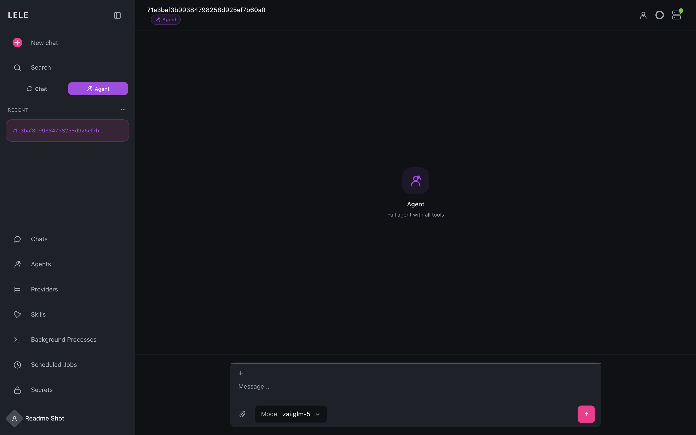
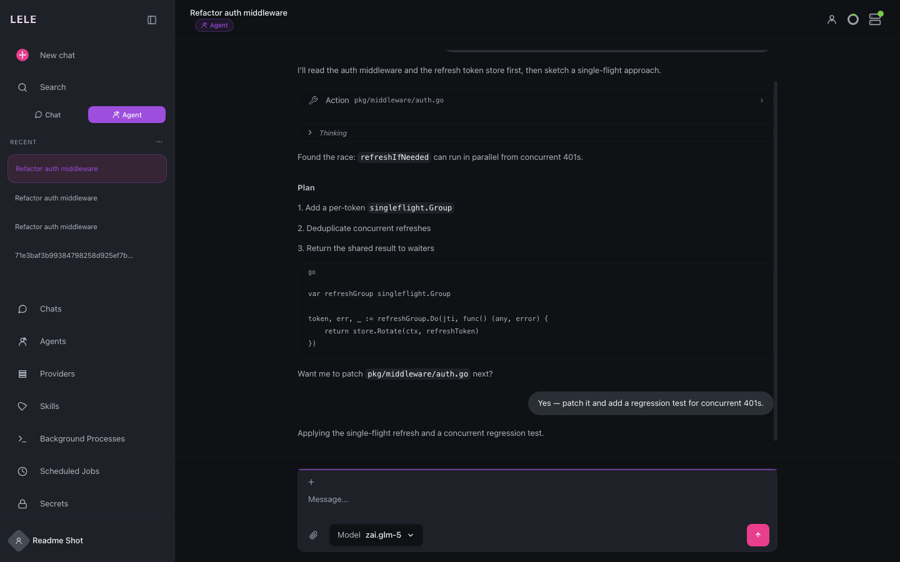

<div align="center">
  
  

  <h1>Lele</h1>

  <p>Trợ lý AI cá nhân nhẹ viết bằng Go — một binary, footprint nhỏ, TUI nhanh.</p>
  <p>
    
    
    
    
    
  </p>

  [中文](README.zh.md) | [日本語](README.ja.md) | [Português](README.pt-br.md) | **Tiếng Việt** | [Français](README.fr.md) | [Español](README.es.md) | [English](README.md)
</div>

---

Lele là trợ lý AI lấy workspace làm trung tâm, dành cho host chạy lâu dài: chat CLI và TUI, gateway đa kênh, web UI, API client gốc, skills, cron và subagent — không cần runtime JS hay stack TUI đa tiến trình.

## Bắt đầu nhanh

```bash
# Linux / macOS / BSD
curl -fsSL https://raw.githubusercontent.com/xilistudios/lele/main/install.sh | sh

# Windows (PowerShell)
irm https://raw.githubusercontent.com/xilistudios/lele/main/install.ps1 | iex
```
```bash
# Từ source
git clone https://github.com/xilistudios/lele.git && cd lele
make deps && make build && make install
```
```
# Thiết lập ban đầu
lele onboard
# Giao diện agent CLI
lele agent -m "Bạn có thể làm gì?"
# TUI
lele tui
```

Script cài đặt xác minh SHA256 và mặc định cài vào `~/.local/bin`.

## Benchmark

Đo trên Apple M1 / macOS arm64. Phiên TUI idle dưới PTY, không gọi model. Startup là trung bình 3 lần chạy `--version`. RSS là bộ nhớ đỉnh của process tree ~6s sau frame đầu tiên.

| Công cụ | Runtime | Dung lượng cài | Startup | RSS TUI idle | Processes |
| --- | --- | --- | --- | --- | --- |
| **lele** | Go + Bubble Tea | **57 MB** một binary | **~25 ms** | **~42 MB** | **1** |
| Claude Code 2.1.267 | Bun-compiled TS | 191 MB binary | ~13 ms | ~170–187 MB | 1 |
| pi 0.85.1 | Bun-compiled TS + pi-tui | 71 MB binary | ~233 ms | ~173 MB | 1 |
| OpenCode 1.17.8 | Bun + OpenTUI | 123 MB binary | ~284 ms | ~1.0 GB đỉnh | 1 |
| Hermes 0.14.0 | Python + Ink | ~1 GB tree | ~236 ms | ~374 MB | 3–4 |

Đường render (Go benches trong repo, frame 200×50): `View()` ≈ 3.4 ms · `paintFrame` ≈ 0.5 ms.

Fingerprint terminal im lặng: alt-screen Bubble Tea cổ điển + mouse + bracketed paste, không spam capability hay OSC sản phẩm.

**Vì sao quan trọng:** một binary tĩnh, ~42 MB khi idle, frame đầu dưới 100 ms — vừa cho host gateway và multi-session.

```bash
time lele --version
go test ./pkg/tui/ -bench='PaintFrame|View' -benchmem -count=1 -benchtime=50x
```

## Tính năng

**Runtime agent**
- Vòng lặp agent dùng tools với giới hạn iteration
- Agent có tên, model fallback, `thinking_level` per-agent (ghi đè bằng `/think`)
- Lưu session (SQLite) và session ephemeral tùy chọn
- Đính kèm file trong luồng native/web

**Giao diện**
- CLI (`lele agent`) và TUI Bubble Tea đầy đủ (`lele tui`)
- Web UI built-in + client REST/WebSocket gốc với ghép PIN
- Gateway cho kênh chat (Telegram, Discord, Slack, WhatsApp, Feishu, Line, QQ, DingTalk, …)

**Tự động hóa**
- Job theo lịch (`lele cron`) và heartbeat task từ `HEARTBEAT.md`
- Skills và subagent bất đồng bộ
- Chat nhóm multi-agent (MoA / round-robin / moderator / pipeline) — xem `docs/moa-group-chat.md`

**An toàn**
- Giới hạn workspace, deny pattern cho exec, luồng phê duyệt
- Token auth cho client gốc, giới hạn upload và TTL

## Ảnh chụp màn hình

### TUI




```bash
lele tui              # session mới
lele tui -s <id>      # resume session
```

Chat streaming, visualization tool, markdown, sidebar session, context stats. Themes: `dracula` (mặc định), `nord`, `catppuccin`, `gruvbox`, `tokyo-night`, `solarized-light` — đổi trong **Settings → Interface**, lưu ở `~/.lele/tui.json`. Ngôn ngữ qua `LELE_LANG` hoặc `/lang`.

### Web UI





1. `lele onboard` — bật web UI, lấy PIN ghép cặp  
2. `lele gateway` — phục vụ `/`, `/api/v1/*`, WebSocket trên cổng `18790`  
3. Mở trình duyệt và ghép PIN  

API client đầy đủ: `docs/client-api.md`.


## Cấu hình

Cấu hình nằm ở `~/.lele/config.json` (template: `config/config.example.json`).

```json
{
  "agents": {
    "defaults": {
      "workspace": "~/.lele/workspace",
      "restrict_to_workspace": true,
      "model": "glm-4.7",
      "max_tokens": 8192,
      "max_tool_iterations": 20
    }
  },
  "providers": {
    "openrouter": {
      "type": "openrouter",
      "api_key": "YOUR_API_KEY"
    }
  }
}
```

Các section chính: `agents.defaults`, `session`, `channels`, `providers`, `tools`, `heartbeat`, `gateway`, `logs`, `devices`.

**Providers:** `anthropic`, `openai`, `openrouter`, `groq`, `zhipu`, `gemini`, `vllm`, `nvidia`, `ollama`, `moonshot`, `deepseek`, `github_copilot`, cùng backend OpenAI-compatible có tên (`model`, `context_window`, `vision`, `reasoning`, …).

**Workspace** (`~/.lele/workspace/`): `sessions/`, `memory/`, `state/`, `cron/`, `skills/`, `AGENT.md`, `HEARTBEAT.md`, `IDENTITY.md`, `SOUL.md`, `USER.md`.

## CLI

| Lệnh | Mô tả |
| --- | --- |
| `lele onboard` | Khởi tạo config và workspace |
| `lele agent` / `lele agent -m "..."` | Agent tương tác hoặc one-shot |
| `lele tui` / `lele tui -s <session>` | Giao diện terminal |
| `lele gateway` | Messaging gateway + web UI |
| `lele auth login` | Xác thực providers |
| `lele status` | Trạng thái runtime |
| `lele cron list` / `lele cron add ...` | Job theo lịch |
| `lele skills list` | Skills đã cài |
| `lele client pin` / `lele client list` | Ghép cặp client gốc |
| `lele version` | Thông tin phiên bản |

## Phát triển

Cần Go 1.25+, [Bun](https://bun.sh/) (web UI), và Make.

```bash
make deps web-build build   # build binary + web
make test fmt vet           # checks
make build-all              # cross-compile
```

## Giấy phép

MIT
